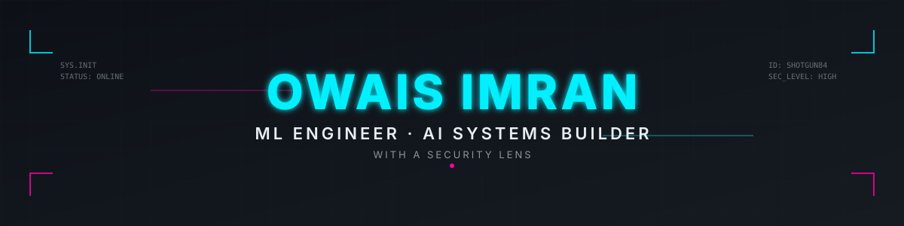

<!-- Hero Banner -->

  

<!-- Tagline -->
<h3 align="center">
  Training small LLMs from scratch. Building pipelines. Breaking systems.
</h3>

 

<!-- Status Bar -->

  
  
  

 

<!-- Featured Project -->
<h2 align="center">🧠 Custom LLM Training</h2>

  Training small language models from scratch using PyTorch, Hugging Face Transformers, and LoRA. Building custom tokenizers, distributed training pipelines, and evaluating emergent behaviors.

  
  
  
  
  

 

<!-- Other Projects -->
<h2 align="center">
  
</h2>

  <b>🌍 Disaster Monitor</b> 
  Global real-time disaster dashboard. Aggregates NASA EONET, USGS, GDACS, and OpenWeather data. 
  
  
  

 

  <b>🔐 LLM Security Research</b> 
  Studying how LLM systems break. Pre-training experiments, adversarial testing, and red-teaming AI pipelines. 
  
  
  

 

<!-- Past Experience -->

  <b>Past:</b> AI Voice Agent @ KaiDubai (Jun 2025 – Jan 2026) — Cold-calling lead qualification system using ElevenLabs + OpenAI LLMs.

 

<!-- Tech Arsenal -->
<h2 align="center">
  
</h2>

  <b>Languages</b> 
  
  
  
  

  <b>AI / ML</b> 
  
  
  
  
  

  <b>Frontend</b> 
  
  
  

  <b>Backend / Deploy</b> 
  
  
  

  <b>Data / Finance</b> 
  
  
  
  

 

<!-- System Stats -->
<h2 align="center">
  
</h2>

  
  

  

 

<!-- Contact / Uplink -->
<h2 align="center">
  
</h2>

  <i>Currently open to ML engineering roles and research collaborations.</i>

 

  
  
  
  

 

<!-- Footer -->

  
  

  <i>System online. Always building.</i>

